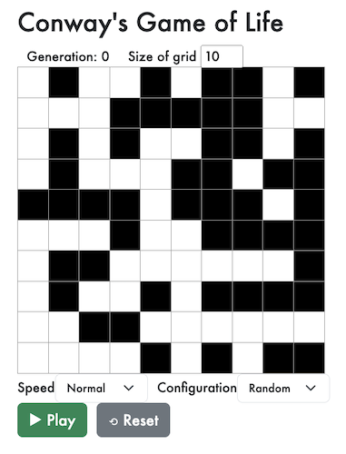

# Conway's Game of Life

## About

**Conway's Game of Life** is a cellular automaton devised by the British mathematician John Horton Conway in 1970. It is not a traditional game, but rather a simulation that follows a set of rules. Despite its simplicity, the Game of Life exhibits many complex and fascinating patterns.

### The Algorithm

The simulation is run on a two-dimensional grid, consisting of square cells that can be either _alive_ or _dead_. Each cell interacts with its eight neighboring cells, which are the cells horizontally, vertically, and diagonally adjacent to it. The game progresses in discrete steps, or generations, where the state of each cell is updated based on its current state and the states of its neighbors.

The Game of Life has become a popular topic in computer science and mathematics, with researchers studying its properties and exploring its computational capabilities. It can generate many interesting patterns, such as oscillators, gliders, spaceships, and even complex structures like replicators. These patterns emerge as a result of the interaction between cells and can evolve in unpredictable ways.

#### Rules
- If a cell is **alive** and it has exactly 2 or 3 live neighbors, it _stays alive_.  
- If a cell is **alive** and it has less than 2 or more than 4 live neighbors, it _dies_.  
- If a cell is **dead** and it has exactly 3 live neighbors, it _comes to life_.  

### Technologies Used

  

## How to Run It
1. `npm install`
2. `npm run start`
3. Navigate to `http://localhost:[port-number]]`
4. Set the size of your board
5. Click to toggle cells as _alive_ or _dead_.
6. Once your starting configuration is set, click _Play_!

---

### About the author

Elissa is an experienced software engineer & educator with a M.S. in Computer Science and over 10 years of experience. 

Let's connect!  
